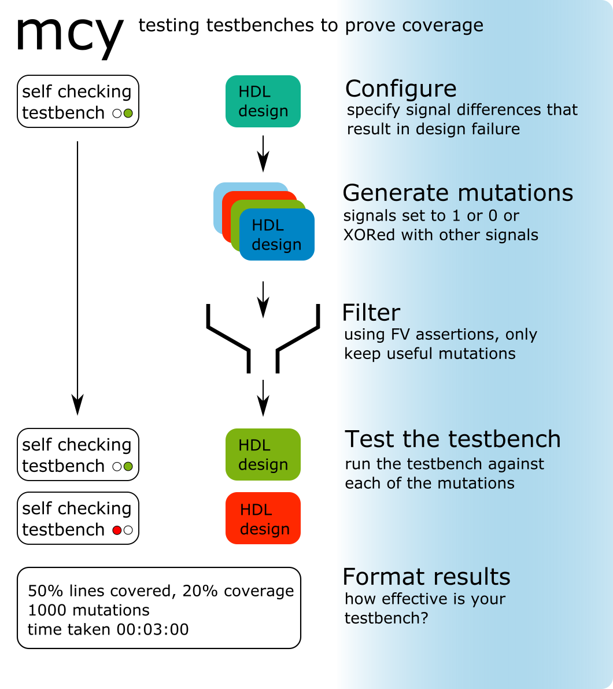

Mutation Cover with Yosys (MCY) Documentation
=============================================

MCY is a new tool to help digital designers and project managers understand and improve testbench coverage.

If you have a testbench, and it fails, you know you have a problem. But if it passes, you know nothing if you don’t know what your testbench is actually testing for.

Given a self checking testbench, mcy generates 1000s of mutations by modifying individual signals in a post synthesis netlist. These mutations are then filtered using Formal Verification techniques, keeping only those that can cause an important change in the design’s output.

All mutated designs are run against the testbench to check that the testbench will detect and fail for a relevant mutation. The testbench can then be improved to get 100% complete coverage.

.. toctree::
   :maxdepth: 3

   quickstart.rst
   methodology.rst
   cmds.rst
   config.rst
   testsetup.rst
   eqsetup.rst
   mutate.rst
